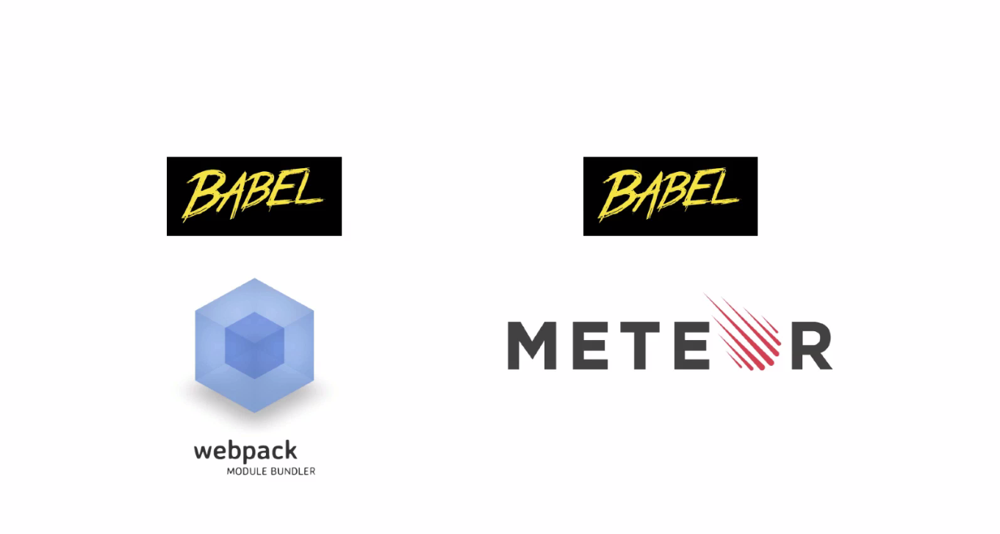

<!-- $theme: gaia -->

Meteor+react+redux+webpack全栈式开发方案
===
# 

---
## Meteor 是什么？

Meteor 是一个全栈型 JS 开发平台，基于 Nodejs 技术。所谓全栈，就是我们可以用一种语言 JS ，同时开发前端和后端程序，用 Meteor 技术开发的 App 不仅仅可以运行在各个浏览器中，包括微信，也可以编译成原生应用，运行在 ios 和 andriod 系统之上。

> Meteor is Unix ，not Rails 。

---
## 为什么讲metor？
- 全栈随动**基于实时数据订阅的，是以实时性为默认的框架**
- spa单页面应用，Meteor 是一个全栈 SPA 框架，这个其实是很特别的。
- 类原生应用（已经有了那么多开发框架了，Laravel ，Django ，Rails ，为何还要发明一个 Meteor 这样一个跟以前的框架有根本性差别的框架呢？答案就是时代不同了，新时代的 App 应该是实时性为默认的，应该是“类原生应用”为默认的。）
- 拥抱各种先进的主流的生态系统
-

---
meteor 差别于一般的框架
meteor官方的说法是: * Meteor is Unix ，not Rails *
# 

---

---

第一点，API 抽离增大工作量。朋友说最初几个项目用 Meteor ，前后端都是他自己一个人弄，不管是同步开发，还是一个人开发，效率都很高。但是现在是 React + API 的前后端分离形式，发现真是一个双刃剑。其实原则应该是这样，自己项目的业务逻辑还是一体完成比较好，硬性分离出 API 是愚蠢的。只有当使用第三方功能，或者自己有高度重复的业务的时候，抽出 API 才是值得的。因为抽出 API 是有成本的：第一，Meteor 为我们做的那些事情，基本上现在都要自己手动做了，例如 Socket.io 实时通讯。第二，每次实现一个小功能，都要两个人碰一下才行，即使我朋友公司已经租了办公室，两个人经常在一个屋子里面，依然感觉很不方便，不利于快速开发。

---

## 全栈随动（ Full Stack Ractivity ）

前面吐槽了传统框架不适合来开发实时性强的应用，那么 meteor 的优势体现在哪里呢？应该说体现在很多方面，但是这里我想强调一点：全栈随动（ Full Stack Ractivity ）

# 
基本的意思就是说，整个应用的数据已经成了”一根筋“：

后端和前端数据通过实时订阅通道，自动同步

React 框架自身也是“随动的”，数据有变化，React 的组件界面就会自动刷新

写过界面的人都能理解，这两个“自动”，让复杂前端界面的开发省去了多少麻烦。

---
## Meteor的工作原理
大家都知道 Socket.io 是当前写实时应用的最佳解决方案了，底层基于的技术就是 Websocket。Meteor 把 Websocket 技术融入到了自己的核心，因为 Meteor 是以实时性为默认的平台。传统的 Web 应用都是走 请求/应答 模式来从服务器端获取数据的，但是 Meteor 采用的却是一套不同的思路。Meteor 通过让客户端代码订阅服务器数据的形式，实际上打通了客户端和服务器端的实时数据通道。

---

# React 和 Meteor 是天生一对
# 

Meteor 是有实时数据通道的，也就是说后端数据如果变化了，前端自动跟着变，反之亦然。而 React 的特点是前端数据如果变了，那界面自动就更新。这两点加到一起结论就是：应用的任何一个位置有了数据修改，界面上马上就会自动体现出来。试想一下，还有比这个默认效果更符合自然人的思维的吗，所以用 Meteor 上手开发应用其实是比以前还要简单的。
# 

Meteor 和 React 一起用是非常棒的。Meteor 提供了简单易用的跨客户端和服务器的数据管理，React 提供了组织复杂 UI 的组件化的思路。

由于 React 只是一个库，不是框架，它只负责 MVC 的 V ，也就是视图层的功能。所以要用 React 构建一个 App ，首先就要涉及到其他层的各个工具的选择问题。你需要打包工具，例如 Webpack ，数据层 Redux ，API 请求可能需要学 GraphQL 。这些还基本都是前端的内容，后台到底是用 Nodejs Java Ruby 还是其他呢？都行，但是还是要自己去选择对应的后台框架和技术。而且实际情况是目前 JS 领域正是爆发期，各种框架进展都很迅速，变动频繁，增加了学习成本。

而 Meteor 提供了一条简单的路。首先 Meteor 在 View 层可以直接支持 React ，这是官方保证的。Meteor 提供了前面我们提到的各种 React 构建完整的 App 所必须的部分，好处是都有高手对这些部分进行的精心的选择和集成。例如 Meteor 有自己的构建系统（提供类似于 Webpack 的功能），可以进行代码转翻，页面自动刷新等各种功能。同时后台的各种功能，服务器，数据库适配，实时数据传输也都为我们做好了。

总结，简单意味着更少的时间花在工具配置上，更多的时间用于实现功能。Meteor 可以让我们快速成型项目，后面如果我们想深入研究某个具体模块，或者扩展功能也是一样可以的。例如添加 Redux 和 GraphQL 这样的功能进来。Meteor 是一套真的可以让 React 变得对 JS 新手友好

---
## 多平台通吃

另外，利用 http://cordova.apache.org/ ， meteor 写成的 Web 应用，可以直接编译成 ios 或者 andriod 的应用。另外一个方案就是使用 react-native ) ，也可以让我们用 JS 就写成手机 App 。

---
API 抽离增加了工作量
# 
---

# 

很多工具例如支持 ES6 和 JSX 编译的 Babel ，如果在 Webpack 或者 gulp 条件下自己去配置，很多时候可能就会出问题，但是 Meteor 这里都内置了，新手不用配置就能用。

Meteor 也拥抱 JS 社区的各个其他主流生态系统。Meteor 拥抱 NPM ，而 NPM 是大家都在用的。选择 React。 Meteor 和 React-Native 也很容易在网上搜到资料，例如这篇 。
meteor 自带的功能少得很。可以安装 meteor 的包来进行扩展。 Meteor 自己的包仓库，目前已经有近一万个包了。另外，meteor 背靠整个 npm 生态，安装普通的 npm 包进 meteor 也是非常方便的。

---
# 

---
自带webpack
# 
