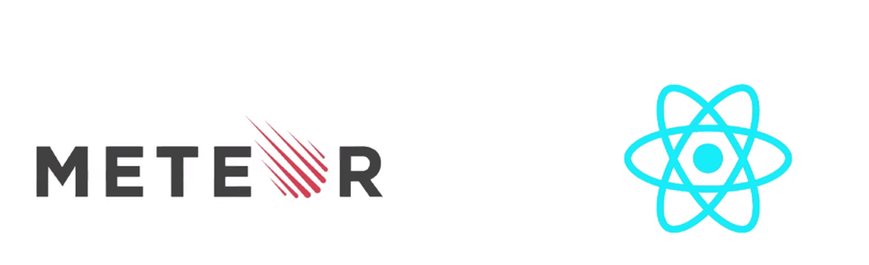
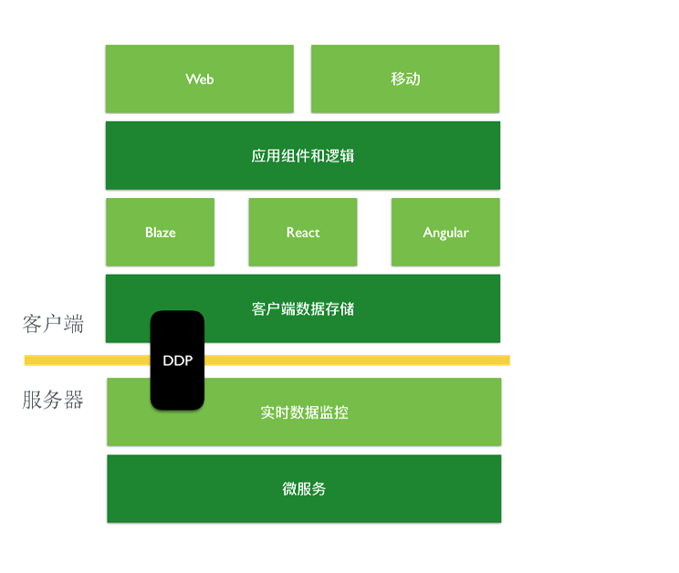
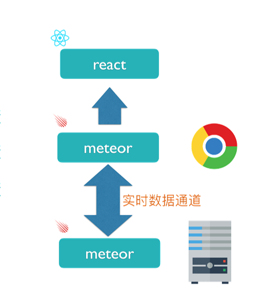
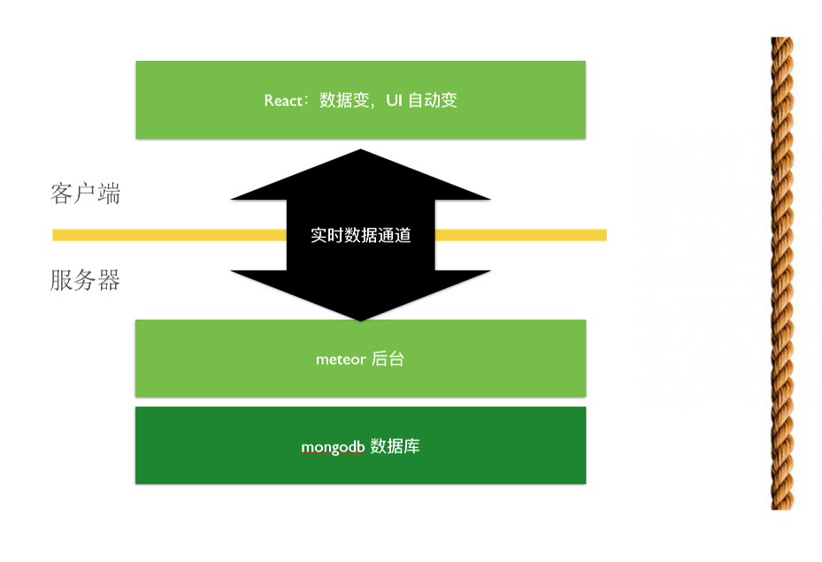
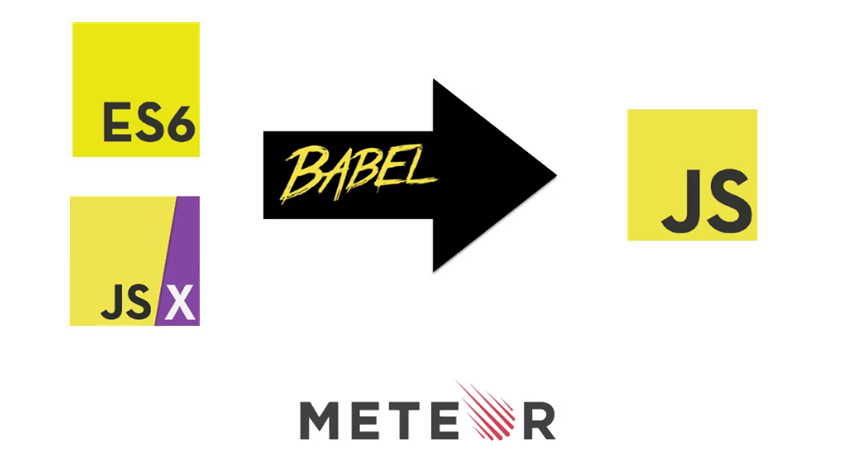
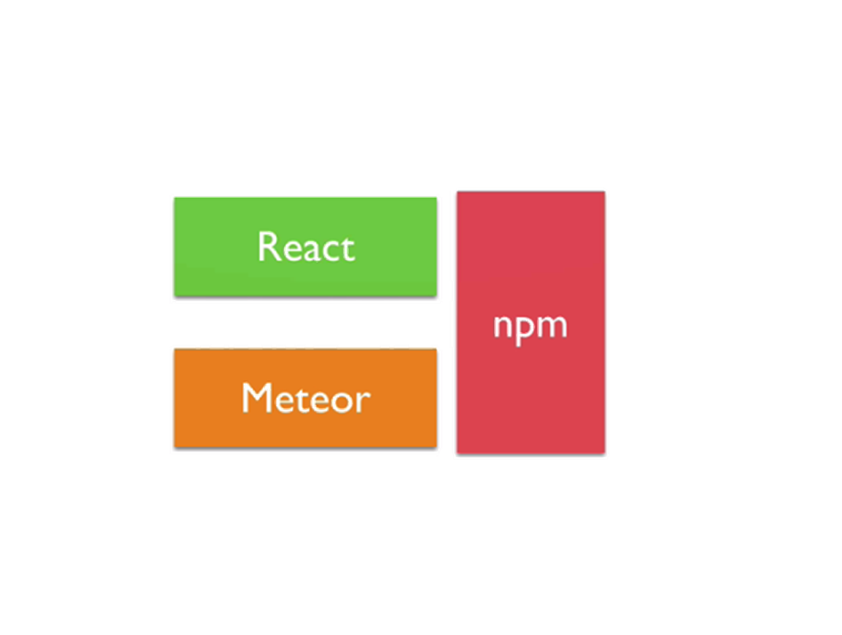

<!-- $theme: default -->
　　　　　　　　Meteor+react
　　　　　　　　　　全栈式开发方案
===

---
## Meteor 是什么？

Meteor 是一个全栈型 JS 开发平台，基于 Nodejs 技术。用 Meteor 技术开发的 App 不仅仅可以运行在各个浏览器中，也可以编译成原生应用，运行在 ios 和 andriod 系统之上。

meteor 差别于一般的框架，meteor官方的说法是：
> Meteor is Unix ，not Rails 。

---
## 为什么讲meteor？

- 全栈随动，**基于实时数据订阅的，是以实时性为默认的框架**
- SPA单页面应用，Meteor 是一个全栈 SPA 框架。
- 类原生应用
- 拥抱各种先进的主流的生态系统(npm、ES6、react、热部署...)
- Js单一语言开发
- 代码压缩混淆部署都由Meteor透明完成

---

---

## 全栈随动（Full Stack Ractivity）

---
## React 和 Meteor是天生一对

---
# API 抽离增加了工作量

---
## Mateor-随时调整

---

---
## 多平台通吃

 

